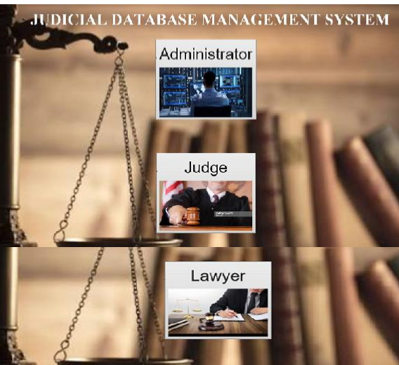
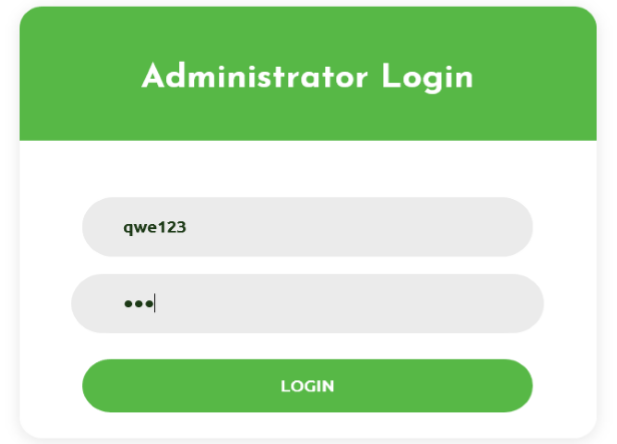
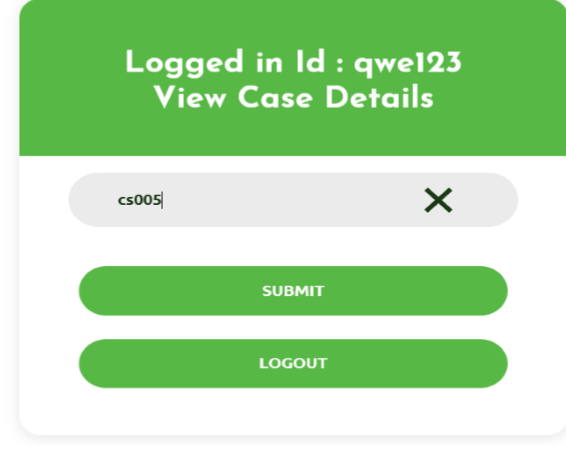
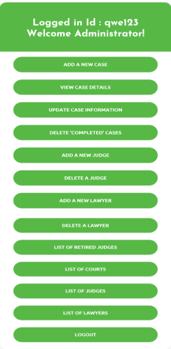

#The project is compiled and executed on the chrome browser with the localhost path extension link:-http://localhost/index.php. We have put in few screen shots in here to show the working of Judicial Database Management System.  Judiciary-DataBase-Management

Initial Index window 

 login page: represents the login page for the administrator. 
 
 
 
 Admin can retrieve case details page. After entering caseid the user will be able to see all the details of that particular case 

 
 
 Administrator Home Page:
 shows the actions that can be performed by the administrator. 
 
 
 
 
